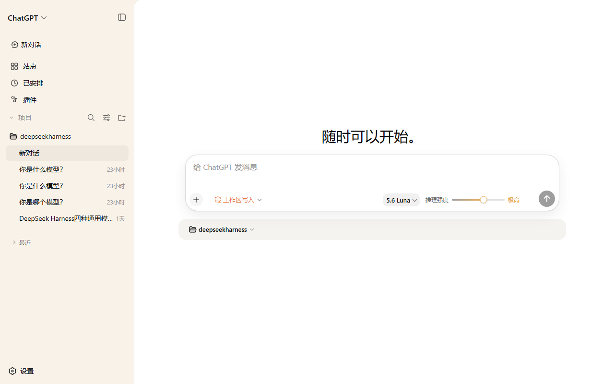
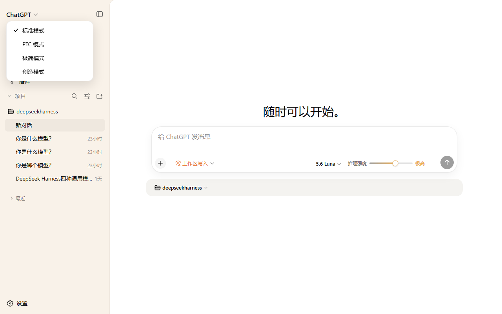
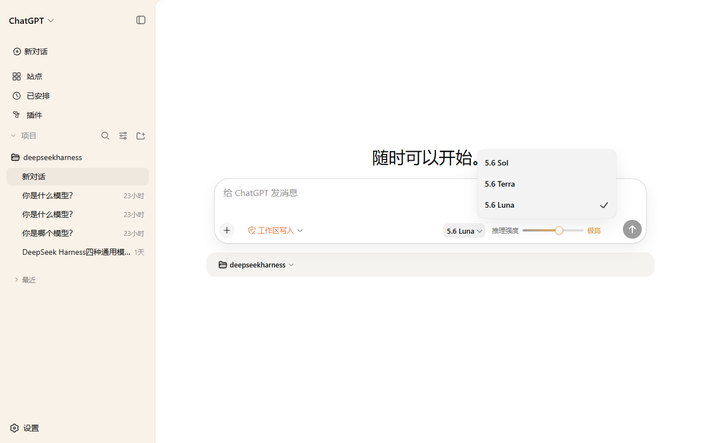
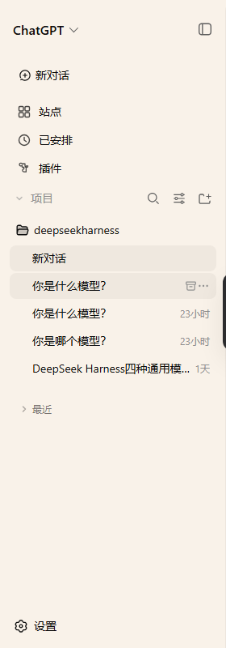
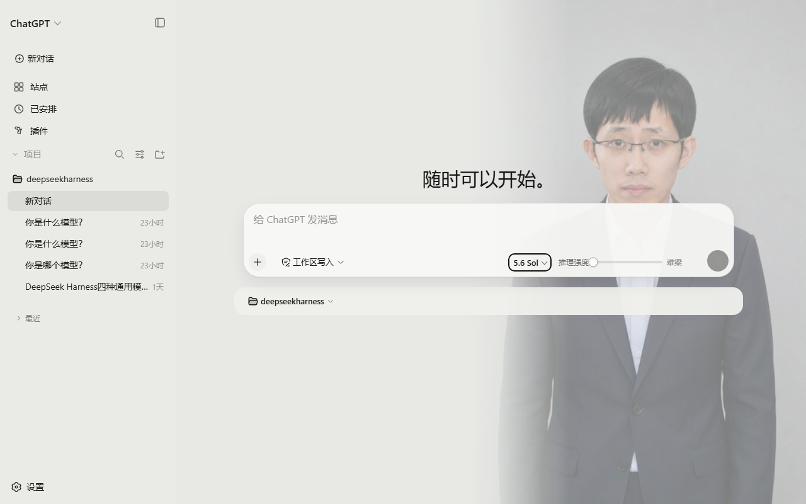
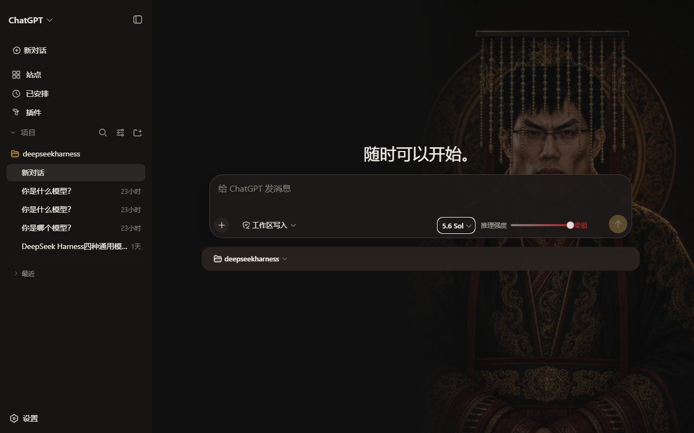

# dsh-chatgpt-desktop

把 **DeepSeek Harness（DSH）** 的界面整套装扮成 **ChatGPT 桌面端** 的客户端覆层插件。

一个插件包，零业务侵入：不改 DSH 任何源码、不重写任何交互逻辑，全部通过浏览器端 DOM 覆层 + 委托原生控件完成。复制本仓库到你的 DSH，重启即得。



## 效果一览

| ChatGPT 化界面 | 品牌下拉切模式 | 三模型菜单 |
|---|---|---|
|  |  |  |

| 归档按钮并排 | 滑动变梁 · 难梁 | 滑动变梁 · 梁祖 |
|---|---|---|
|  |  |  |

## 特性

**ChatGPT 桌面端皮肤（浅色）**
- 米色侧栏 `#F9F2E9` + 白色内容卡片 + 官方 alpha 悬停/边框 token，像素级采样自 ChatGPT 桌面端实机截图
- 左上角 `ChatGPT ⌄` 字标下拉，点击直接切换 DSH 四种模式（标准 / PTC / 极简 / 创造），当前项打勾
- 输入卡 26px 大圆角白卡、近黑发送键、橙色权限芯片（只读 / 工作区写入 / 完全访问，已中文化）
- 「选择项目」芯片移至输入框下方并加深底色；模式芯片不再重复显示
- 侧栏完整复刻：新对话、站点 / 已安排 / 插件（占位入口）、**项目**与**最近**两个可折叠分区（状态记忆）
- 会话行悬停时**归档按钮与三点菜单并排**，一键归档
- 全套文案 ChatGPT 化（"随时可以开始。"、"给 ChatGPT 发消息"……），深色主题不受影响

**三模型伪装**
- 模型菜单自上而下固定为 **5.6 Sol → 5.6 Terra → 5.6 Luna**
  - `5.6 Sol` = DeepSeek-V4-Pro　`5.6 Luna` = DeepSeek-V4-Flash　`5.6 Terra` = Kimi K3（可选接入，见下文）

**六档推理强度滑杆**
- 拖动式滑杆，六档显示为 **低 / 中 / 高 / 极高 / 最高 / Ultra**，填充色随档位渐变（灰→蓝→绿→橙→红）
- 按比例委托到原生档位（DeepSeek 的 Off/High/Max、Kimi 的四档），真实生效

**5.6 Sol 专属彩蛋皮肤：滑动变梁**
- 选中 5.6 Sol 时，六档名称变为 **难梁 / 牢梁 / 梁子 / 梁圣 / 梁神 / 梁祖**
- 整个界面背景随滑杆拖动实时演变：右侧人物从西装青年渐至冕冠帝王，界面从灰米浅壳翻转为黑金暗壳
- 灵感与素材：[kingOfSoySauce/dsh-liang-skin](https://github.com/kingOfSoySauce/dsh-liang-skin)（0–30 强度轴六阶段锚点）

## 安装

前置：已安装 DSH（桌面端或 CLI），并至少运行过一次（生成 `~/.dsh/profiles/<profile>` 目录）。

### 方式一：一键脚本（推荐）

克隆本仓库后：

```sh
# Windows PowerShell（默认安装到 desktop profile）
powershell -NoProfile -ExecutionPolicy Bypass -File scripts\install.ps1

# macOS / Linux / Git Bash
bash scripts/install.sh            # 默认 profile 为 desktop，可传参更换
```

脚本会做四件事：复制插件到 `~/.dsh/profiles/<profile>/plugins/`、在 profile 的 `package.json` 登记 `file:` 依赖、向 `cordis.patch.yml` 追加挂载条目、执行 `pnpm install` 生成链接。全部幂等，可重复运行。

### 方式二：手动安装

```sh
# 1. 复制插件（二选一：克隆或直接下载本仓库）
git clone https://github.com/jjy114514/dsh-chatgpt-desktop.git
cp -r dsh-chatgpt-desktop ~/.dsh/profiles/desktop/plugins/dsh-chatgpt-desktop

# 2. 编辑 ~/.dsh/profiles/desktop/package.json，dependencies 中加入：
#    "dsh-chatgpt-desktop": "file:plugins/dsh-chatgpt-desktop"

# 3. 把本仓库根目录 cordis.patch.yml 里的条目追加到
#    ~/.dsh/profiles/desktop/cordis.patch.yml

# 4. 生成依赖链接
cd ~/.dsh/profiles/desktop && pnpm install
# Windows 上没有全局 pnpm 时，可用 DSH 桌面端自带的：
# "%APPDATA%\DSH Desktop\runtime-commands\bin\pnpm.cmd" install
```

**重启 DSH**，浅色主题下即可看到完整效果。

### 验证

```sh
ls ~/.dsh/profiles/desktop/node_modules/dsh-chatgpt-desktop/lib/client.js
```

## 可选：接入 Kimi 作为 5.6 Terra

插件的模型菜单默认重排为 Sol → Terra → Luna；不接入 Kimi 时 Terra 不出现，其余功能不受影响。接入步骤（纯配置，利用 DSH 内置的 pi-ai 多供应商适配器，热加载）：

1. 编辑 `~/.dsh/settings.yaml`，追加：

   ```yaml
   llm-pi-ai:
     providers:
       kimi-coding:
         apiKeyEnv: KIMI_API_KEY
         models:
           - id: k3
   ```

2. 编辑 `~/.dsh/.credentials.yaml`，追加一行：

   ```yaml
   KIMI_API_KEY: 你的-kimi-coding-密钥
   ```

   端点为 Kimi for Coding（`https://api.kimi.com/coding`，pi-ai 内置 `kimi-coding` 目录路由，Anthropic 协议，模型 `k3`，1M 上下文）。

3. 重启 DSH，模型菜单中即出现 **5.6 Terra**。

## 卸载

```sh
# 1. 从 ~/.dsh/profiles/<profile>/package.json 的 dependencies 中删除 dsh-chatgpt-desktop 一行
# 2. 从 cordis.patch.yml 中删除 chatgpt-desktop-theme 挂载条目
# 3. 删除 ~/.dsh/profiles/<profile>/plugins/dsh-chatgpt-desktop 目录
# 4. cd ~/.dsh/profiles/<profile> && pnpm install
# 5. 重启 DSH
```

界面立即恢复官方样式；插件不触碰任何会话数据与模型配置。

## 原理与限制

- 纯客户端覆层：注入一段 CSS + 一个 rAF 节流的 MutationObserver 文案替换器；所有交互（切模型/调档位/归档/切模式）都是**代点原生控件**，不重写业务逻辑
- 梁皮肤六张人物图已压缩内嵌（共约 240KB base64），无网络依赖
- 仅适配浅色主题；深色主题保持官方样式
- **维护提示**：DSH 前端使用哈希 CSS 类名（如 `._7KE1Ra_trigger`），官方大版本升级后类名可能变化，届时需同步更新 `lib/client.js` 中的选择器。已在 `0.1.0-rc.6` 上验证

## 致谢

- 皮肤概念与人物素材：[kingOfSoySauce/dsh-liang-skin](https://github.com/kingOfSoySauce/dsh-liang-skin) → [Lichtspektrum/liang-intensity-calibrator](https://github.com/Lichtspektrum/liang-intensity-calibrator)
- UI 设计基准：ChatGPT 桌面端 + [openai/apps-sdk-ui](https://github.com/openai/apps-sdk-ui) 设计 token

## 许可

代码 MIT；人物图片素材版权归原作者所有，详见 [LICENSE](LICENSE)。
